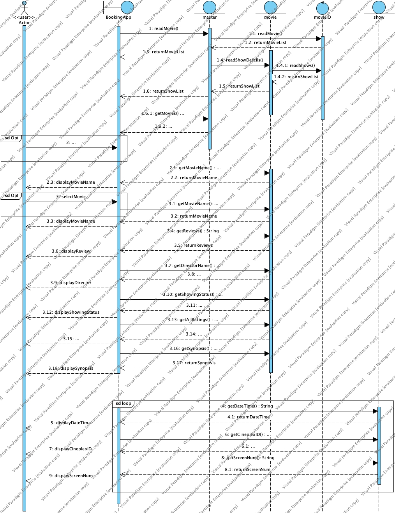

# Movie Booking and Listing Management Application (MOBLIMA)

MOBLIMA is an application to computerize the processes of making online booking and purchase of movie tickets, listing of movies and sale reporting. It will be used by the movie-goers and cinema staff.

> CZ2002 Object Oriented Programming and Design \
> School of Computer Science and Engineering \
> Nanyang Technological University

## Authors

* **Jay Gupta**
* **Arumugam Ramaswamy**
* **Mehul Kumar**
* **Tianyi Wan**
* **Anusha Datta**

## UML Class Diagram

## UML Sequence Diagram

